```{r setup}
library(magick)

cohorts_5yr = c(
  "1920","1925","1930","1935","1940","1945",
  "1950","1955","1960","1965","1970","1975","1980"
)

frames = lapply(cohorts_5yr, function(coh) {
  img = image_read(paste0("../output/figures/trans_", coh, "_5yr.png"))
  image_scale(img, "1200")
})

gif = image_animate(image_join(frames), fps = 1, optimize = TRUE)
image_write(gif, "../output/figures/trans_cohort_5yr_anim.gif")
```

## Transition Matrices

### Diachronic change

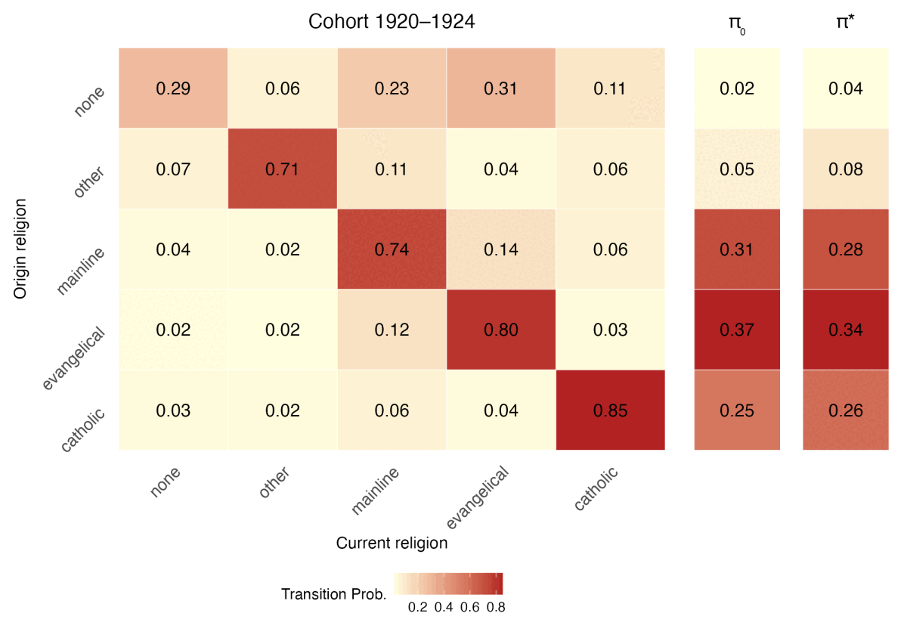

### By cohort

::: {.panel-tabset}

## 1920–1929
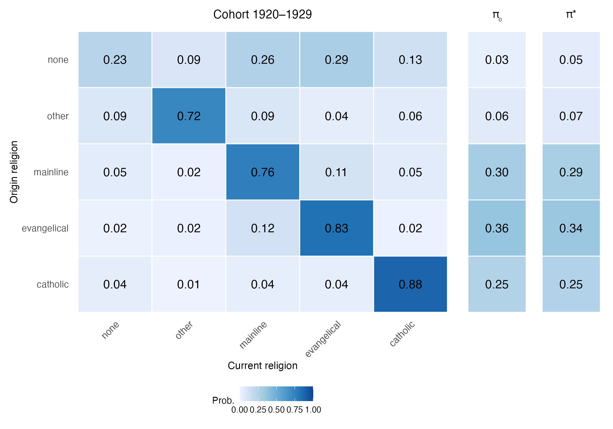

## 1930–1939
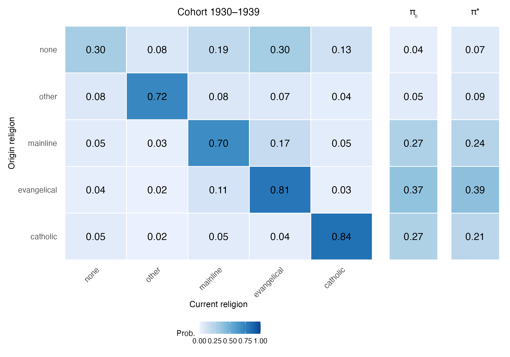

## 1940–1949
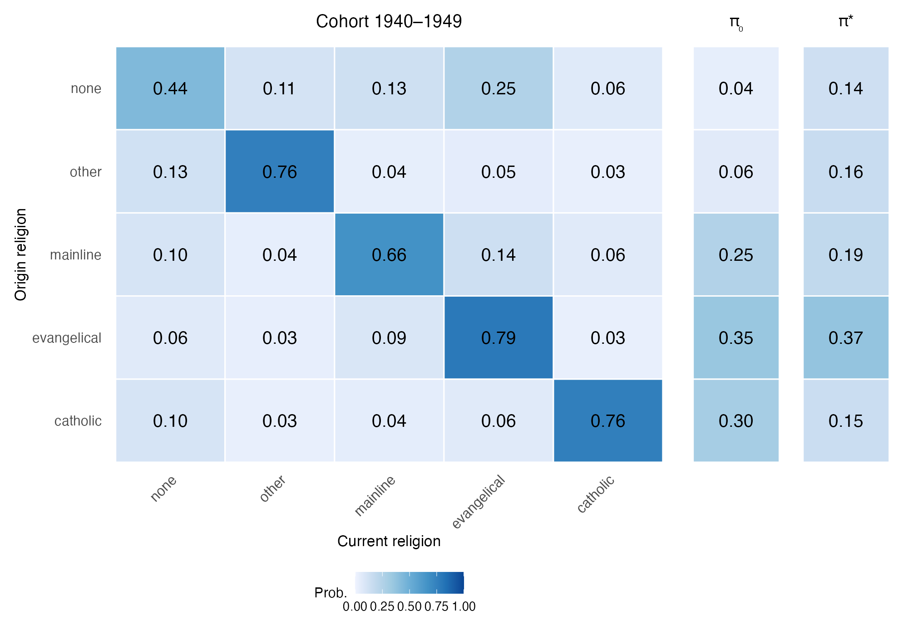

## 1950–1959
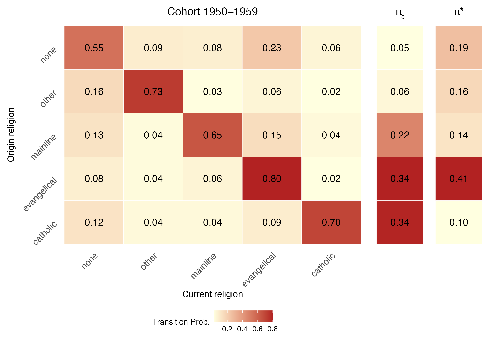

## 1960–1969
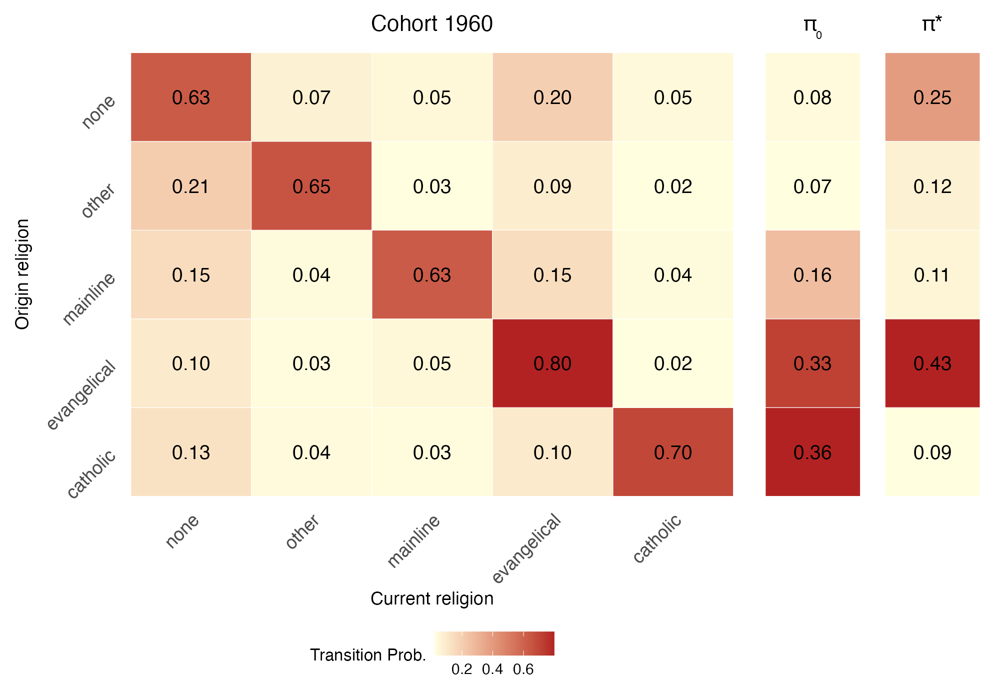

## 1970–1979
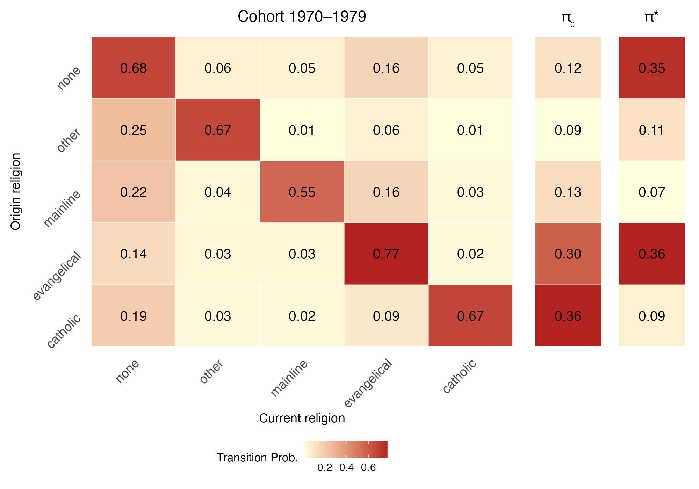

## 1980–1989
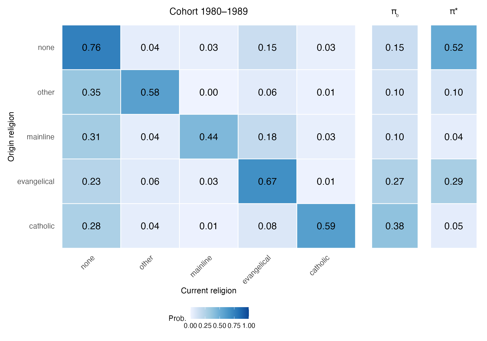

:::

## Exchange and Structural Mobility

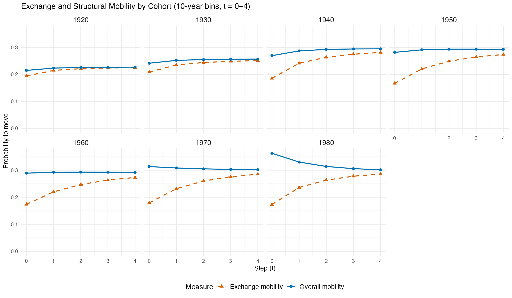

## Intergenerational Memory Curves

::: {.panel-tabset}

## 10-year cohorts
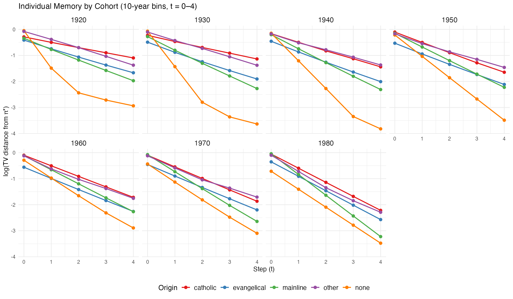

## 20-year cohorts
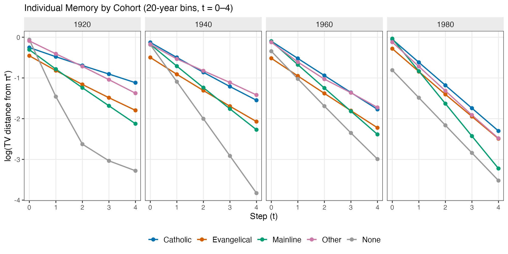

:::

## Regional Breakdowns

### Transition matrices

::: {.panel-tabset}

## Midwest
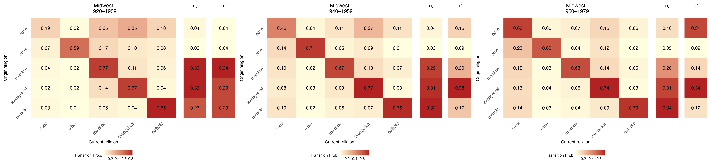

## Northeast
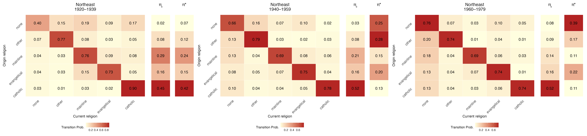

## South
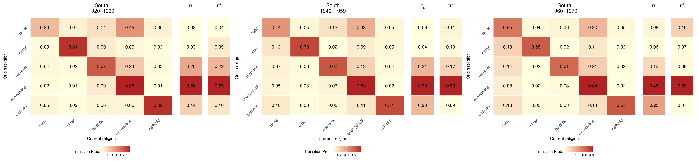

## West
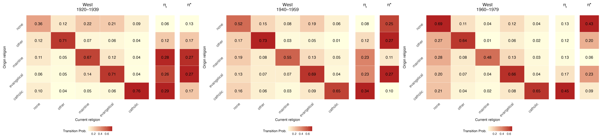

:::

### Mobility by region

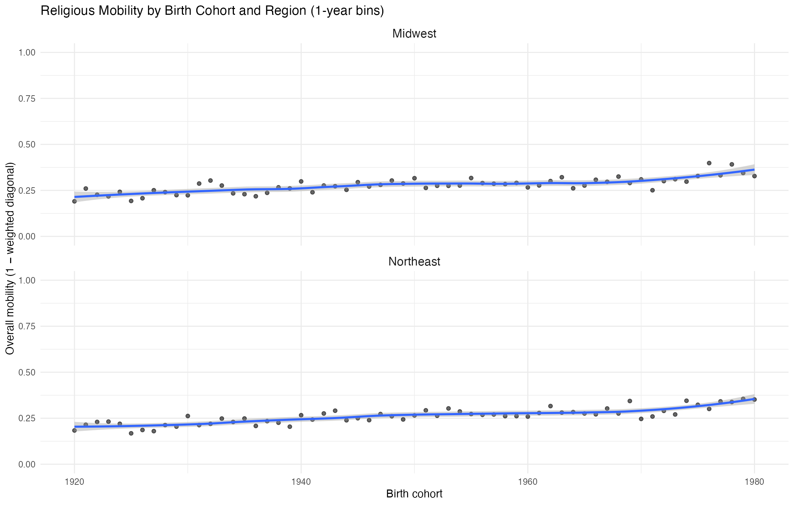
