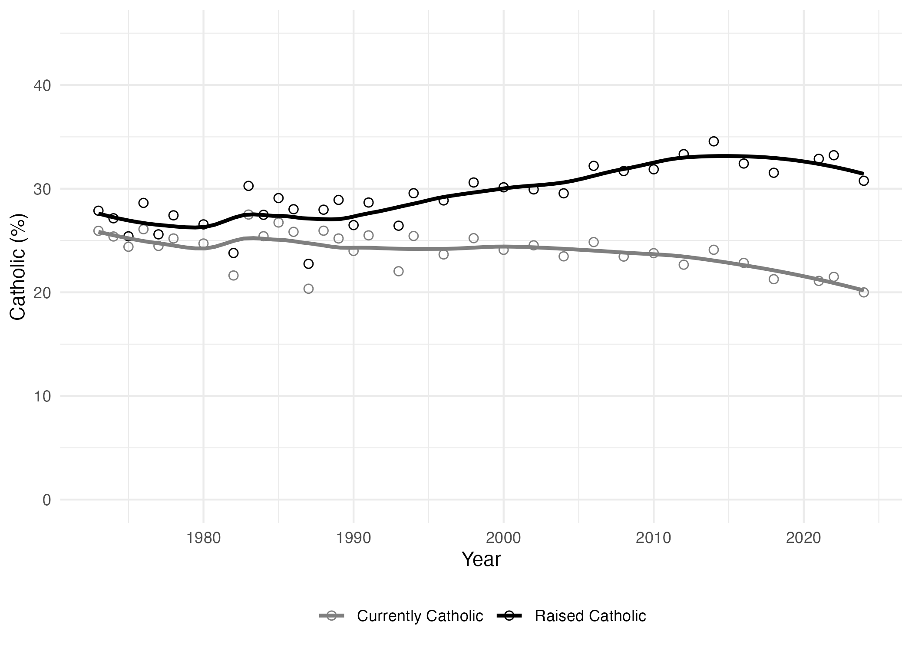
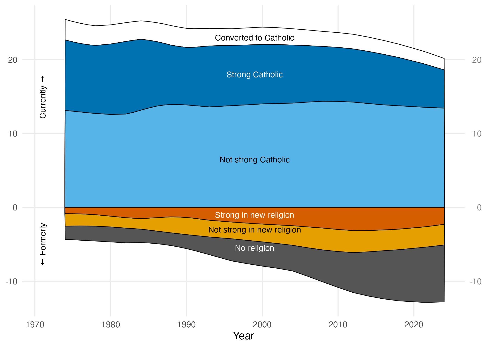
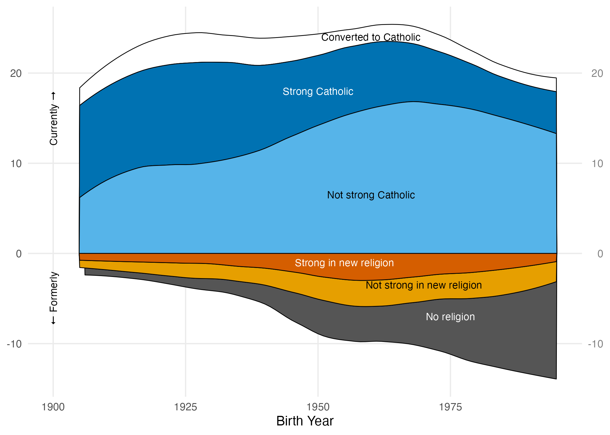
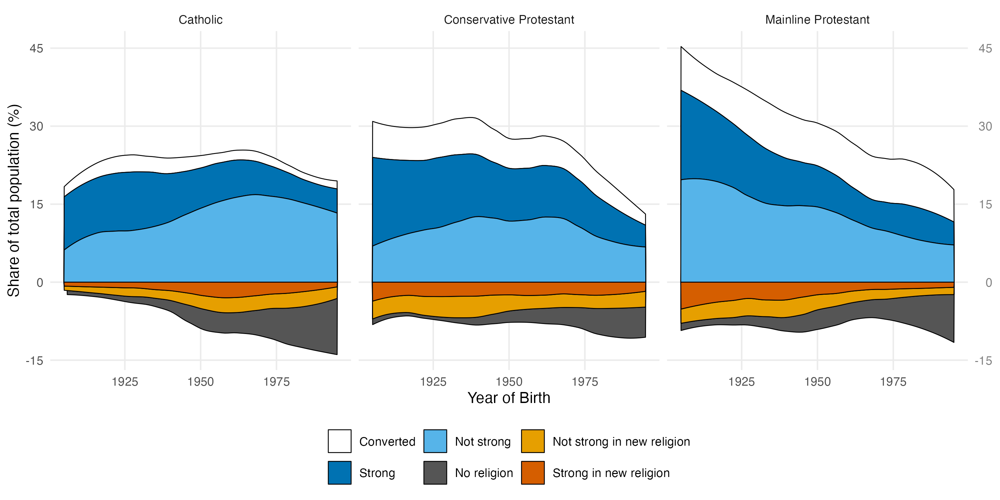
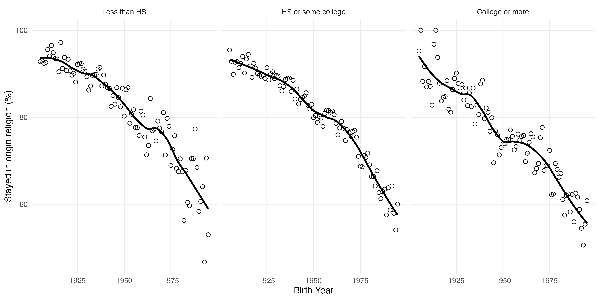
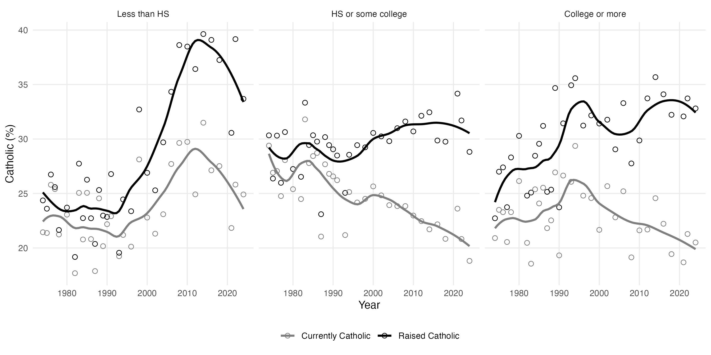

# Summary Statistics: Religious Persistence in the GSS

This memo presents descriptive figures on religious affiliation, switching, and persistence using the General Social Survey (1972--2024).

---

## Figure 1: Currently vs. Raised Catholic Over Time

Share of GSS respondents identifying as currently Catholic versus raised Catholic, by survey year. Loess-smoothed trends show the growing gap between origin and current Catholic affiliation over time.

---

## Figure 2: Catholic Retention and Switching by Year

Stacked area plot decomposing Catholic-origin respondents by current status (survey year on x-axis). Above zero: converts to Catholicism, strong Catholics, and not-strong Catholics. Below zero: those who left for no religion, or switched to another religion (strong/not strong). Shares are loess-smoothed and expressed as a percentage of all respondents.

---

## Figure 3: Catholic Retention and Switching by Birth Cohort

Same decomposition as Figure 2, but plotted by birth cohort (1905--1995) rather than survey year. This highlights generational shifts in Catholic retention and defection patterns.

---

## Figure 4: Retention and Switching by Denomination and Birth Cohort

Three-panel stacked area plot comparing Catholic, Conservative Protestant, and Mainline Protestant groups by birth cohort. Above zero: converts in, strong persisters, and not-strong persisters. Below zero: switchers to no religion or another religion. Shares are expressed as a percentage of the total GSS population in each cohort.

---

## Figure 5: Religious Persistence by Education and Birth Cohort

Three-panel scatter plot showing the share of respondents who remained in their origin religion, by birth cohort, stratified by education level (less than high school, high school or some college, college or more). Loess curves are overlaid. Respondents raised with no religion are excluded.

---

## Figure 6: Currently vs. Raised Catholic by Education and Year

Three-panel scatter plot showing the share of respondents who are currently Catholic versus raised Catholic, by survey year, stratified by education level. Highlights whether the Catholic retention gap varies across education groups.
